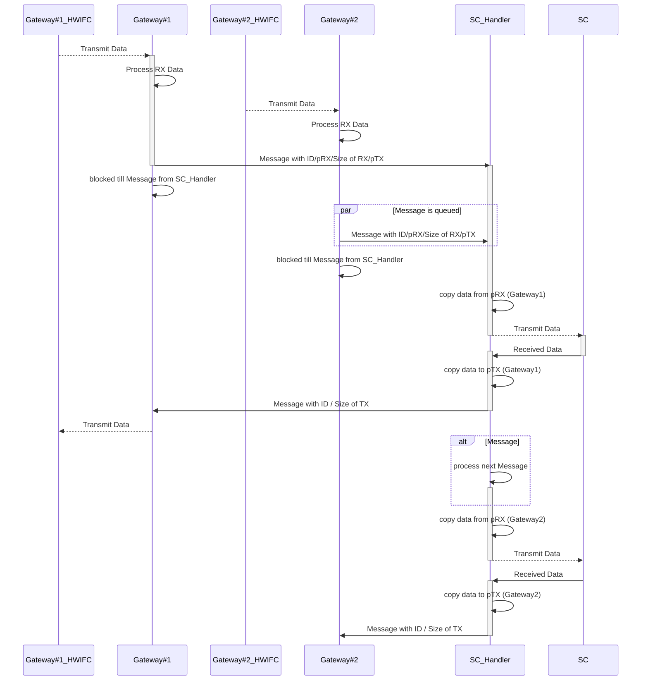

```mermaid
sequenceDiagram
    Gateway#1_HWIFC-->>+Gateway#1: Transmit Data
    Gateway#1->>Gateway#1: Process RX Data
    
    Gateway#2_HWIFC-->>Gateway#2: Transmit Data
    Gateway#2->>Gateway#2: Process RX Data

    Gateway#1->>-SC_Handler: Message with ID/pRX/Size of RX/pTX
    activate SC_Handler
    Gateway#1->>Gateway#1: blocked till Message from SC_Handler

    par Message is queued
    Gateway#2->>SC_Handler: Message with ID/pRX/Size of RX/pTX
    end
    Gateway#2->>Gateway#2: blocked till Message from SC_Handler
    
    SC_Handler->>SC_Handler: copy data from pRX (Gateway1)
    SC_Handler-->>-SC: Transmit Data
    activate SC
    SC->>+SC_Handler: Received Data
    deactivate SC

    SC_Handler->>SC_Handler: copy data to pTX (Gateway1)
    SC_Handler->>-Gateway#1: Message with ID / Size of TX

    Gateway#1-->>Gateway#1_HWIFC: Transmit Data 
    
    alt Message
    SC_Handler->>+SC_Handler: process next Message
    end

    SC_Handler->>SC_Handler: copy data from pRX (Gateway2)
    SC_Handler-->>-SC: Transmit Data
    SC->>+SC_Handler: Received Data
    SC_Handler->>SC_Handler: copy data to pTX (Gateway2)
    SC_Handler->>-Gateway#2: Message with ID / Size of TX
```